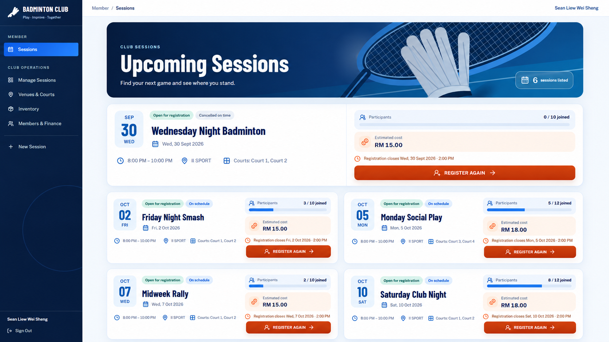
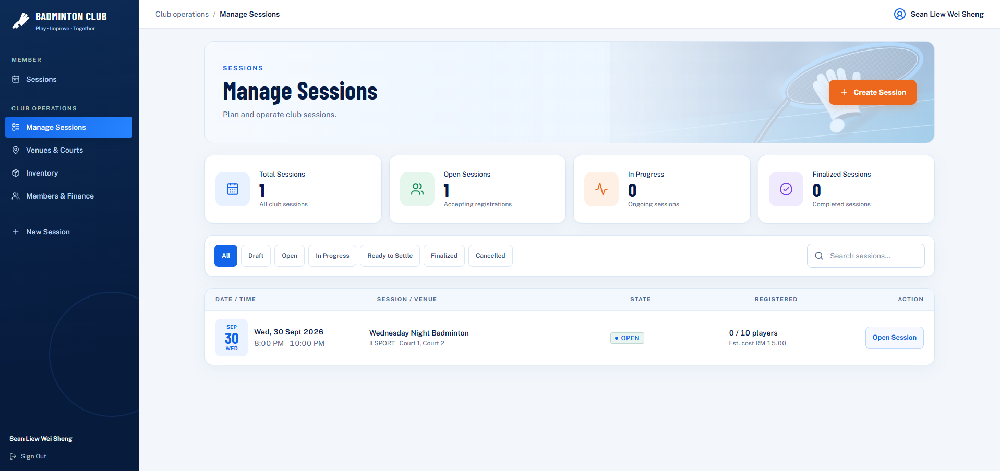
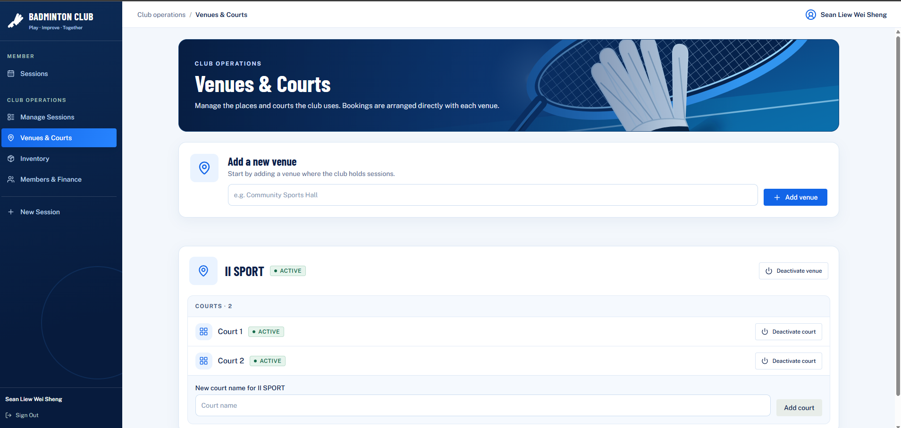

# Badminton Club Management System — Project Showcase

A public showcase for [Sean Liew's Badminton Club Management System](https://badminton-club-liewww.vercel.app/). It introduces the project, explains the club workflow, and lets visitors explore the interface without a club account. The management application itself requires sign-in.

This repository contains the **showcase website**, not the management application's source code.

## What the showcase covers

- **Plan:** Create a session, assign a venue and courts, and open registration.
- **Play:** Let members sign up while organisers manage participants and attendance.
- **Settle:** Track expenses, shuttlecock use, session charges, and member balances.
- **Explore:** Switch between member sessions, admin sessions, and venue management views.

The showcase also describes the underlying application's engineering work, including court booking conflicts, role-based access, and safe session finalisation. The application uses React, TypeScript, and Vite on the frontend, with Python, Flask, SQLAlchemy, PostgreSQL, and Alembic on the backend. The **showcase website** is built with Next.js, React, TypeScript, and CSS.

## Screenshots

| View | Image | Notes |
| --- | --- | --- |
| Member sessions |  | Illustrative preview based on the application's design. Session entries are sample content. |
| Admin sessions |  | Screenshot of the management application. |
| Venues and courts |  | Screenshot of the management application. |

## Run locally

Requires Node.js 20 or later.

```bash
git clone https://github.com/liewww89/badminton-club-liewwwshowcase.git
cd badminton-club-liewwwshowcase
npm ci
npm run dev
```

Open [http://localhost:3000](http://localhost:3000). To make a production build, run `npm run build`. Next.js exports the static site to `out/`.

## Deploy to Vercel

1. In Vercel, select **Add New → Project** and import this GitHub repository.
2. Select **Next.js** as the framework preset and keep the root directory at the repository root (`./`). No environment variables are needed.
3. Select **Deploy**. Vercel will provide a `*.vercel.app` URL.
4. To use a personal domain, add it under the project's **Settings → Domains** and follow the DNS instructions shown by Vercel.

Push later changes to `main` to trigger a new deployment.

## Project structure

| Path | Purpose |
| --- | --- |
| `src/app/showcase.tsx` | Page content, feature descriptions, and screenshot tabs |
| `src/styles/index.css` | Page styling and responsive layout |
| `public/showcase/` | Showcase images |
| `src/app/layout.tsx` | Page metadata and document layout |
| `next.config.js` | Static export configuration |

## Attribution

This project started from the MIT-licensed [Startup Next.js template](https://github.com/NextJSTemplates/startup-nextjs). Its license is retained in [LICENSE](LICENSE). The showcase content and design were adapted for Sean Liew's badminton management project.
